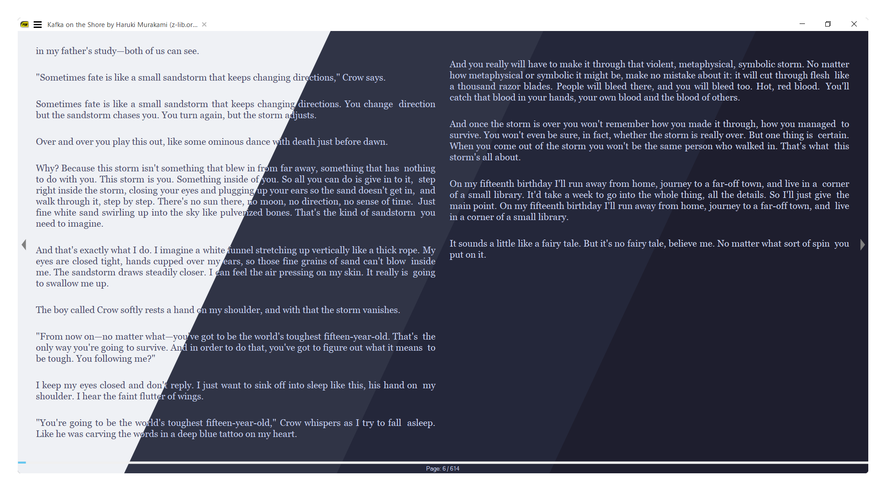
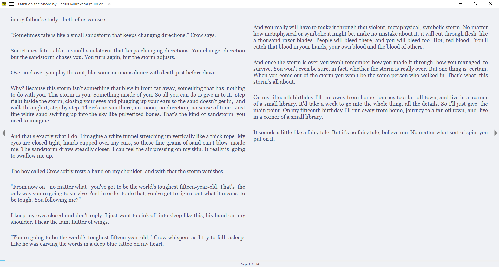
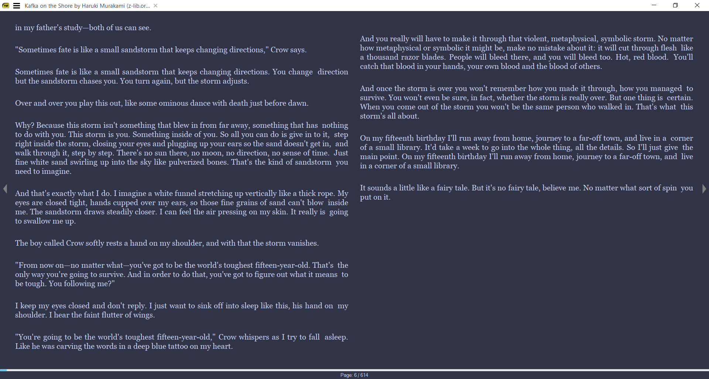
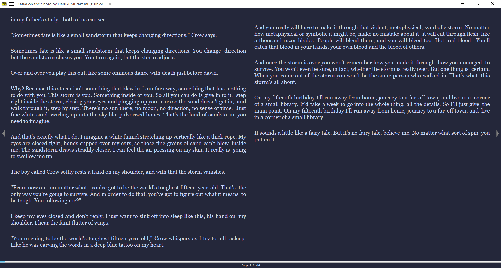
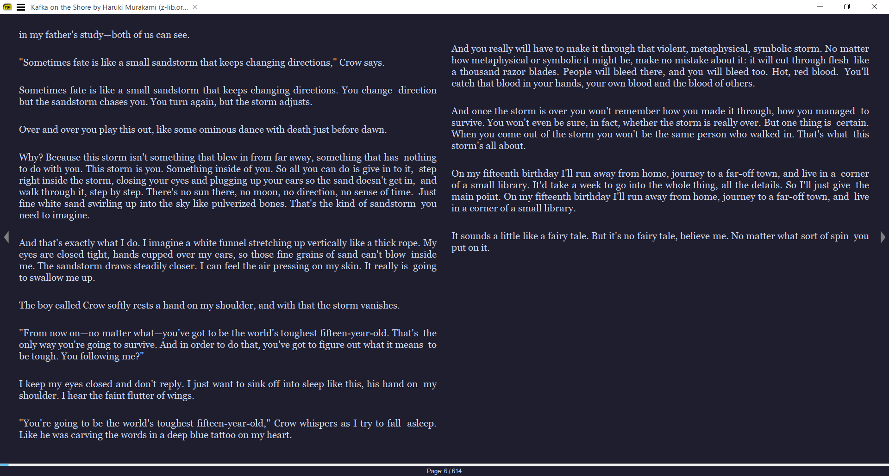

<h3 align="center">
	 
	
	Catppuccin for 
  <a href="https://sumatra-pdf.en.softonic.com/">Sumatra PDF</a>
	
</h3>

  
  
  

  

## Previews

🌻 Latte

🪴 Frappé

🌺 Macchiato

🌿 Mocha

## Usage

1. Navigate to the `SumatraPDF` directory (located in `AppData/Local/SumatraPDF`).
2. Open the file `SumatraPDF-settings.txt`, you may want to create a backup of the file.
3. Select one of the themes from the themes folder to use, the color palette is given [here](https://github.com/catppuccin/catppuccin#-palettes) if you want to preview colors.
2. Replace everything from line `3 to 49` in `SumatraPDF-settings.txt` with the whole content of the theme file, for example - [`macchiato.txt`](/themes/macchiato.txt).
4. Save the file and you would be able to see the changes.

## 💝 Thanks to

- [Ashish](https://github.com/asheeeshh)

&nbsp;

Copyright &copy; 2021-present <a href="https://github.com/catppuccin" target="_blank">Catppuccin Org</a>

